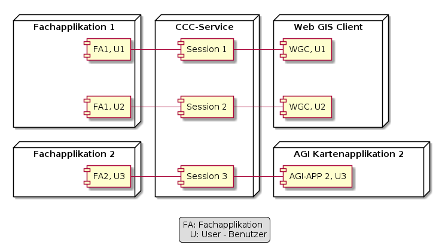

# CCC-Service

## Funktionsweise

Der CCC-Service verbindet als "Mittelsmann" GIS-unwillige Fachapplikationen
mit den Kartenapplikationen des AGI.

Mittels der "INIT"-Nachrichten wird dabei in der User-Session das Pairing für
einen User zwischen der Fachapplikation und der entsprechenden GIS-Applikation initialisiert.

Die Session stellt sicher, dass die Nachrichten für den Benutzer korrekt von der
Fachapplikation an die Kartenapplikation des AGI weitergereicht wird.

Die Kommunikation erfolgt bidirektional über Web Socket. Sprich die Fach- und
Kartenapplikationen sind sowohl Sender wie auch Empfänger von Nachrichten.

## Protokoll V1.0 – Nachrichten

|Name|Richtung|Typ|Beschreibung|
|---|---|---|---|
|connectApp|F > CCC|INIT|Anfrage der Fachapplikation, in die entsprechende Session aufgenommen zu werden.|
|connectGis|K > CCC|INIT|Anfrage der Kartenapplikation, in die entsprechende Session aufgenommen zu werden.|
|notifySessionReady|CCC > F,K|INIT|Nachricht des CCC-Service an Fach- und Kartenapplikation, dass beide Seiten der Session beigetreten sind, und nun "RUN"-Nachrichten ausgetauscht werden können.|
|createGeoObject|F > K|RUN|Versetzt den Web GIS Client, nach Zoom auf den entsprechenden Ort, in den Editiermodus. Anschliessend erfasst der Benutzer an der entsprechenden Stelle die neue Geometrie.|
|editGeoObject|F > K|RUN|Mit dieser Nachricht wird die bestehende Geometrie eines Fachobjektes im GIS editiert. Verhalten des Web GIS Client analog zu «createGeoObject».|
|showGeoObject|F > K|RUN|Bewirkt das zentrierte und selektierte Anzeigen des übergebenen Fachobjektes in der Karte des Web GIS Client.|
|cancelEditGeoObject|F > K|RUN|Aufforderung an die Kartenapplikation, den Edit-Status zu beenden.|
|notifyObjectUpdated|F > K|RUN|Benachrichtigung, dass Informationen eines Fachobjektes geändert wurde → Kartenapplikation lädt darauf beispielsweise die Karte neu.|
|notifyEditGeoObjectDone|K > F|RUN|Mit dieser Nachricht sendet der Web GIS Client nach dem Beenden des Editierens die erfasste / geänderte Geometrie des Fachobjektes an die Fachapplikation.|
|notifyGeoObjectSelected|K > F|RUN|Nach Empfang dieser Nachricht zeigt die Fachapplikation die Informationen des auf der Karte selektierten Fachobjektes an.|
|notifyError|Tri-Dir|ERR|Damit werden Fach- und Kartenapplikation über Fehler benachrichtigt. Absender ist bei Protokollfehlern der CCC-Service, bei Verarbeitungsfehlern die Fachapplikation oder die Kartenapplikation.|

Details: [Spezifikation V1.0 (PDF)](docs/res/Spezifikation_CCC_Schnittstelle_V1.0.pdf)

## Protokoll V1.2 – Erweiterungen

|Name|Richtung|Typ|Beschreibung|
|---|---|---|---|
|changeLayerVisibility|F > K|RUN|Aufforderung an die Kartenapplikation, eine geladene Ebene auf sichtbar/unsichtbar zu schalten.|
|reconnectGis / reconnectApp|F,K > CCC|RUN|Anfrage eines V1.2-Clients, nach einem Verbindungsunterbruch wieder in die bestehende Session aufgenommen zu werden.|
|keyChange|CCC > F,K|RUN|Aufforderung des Servers an einen V1.2-Client, die Keys auszutauschen.|

`notifySessionReady` wird mit V1.2 um `connectionKey` und `sessionNr` erweitert.

Details: [Protokoll V1.2 Erweiterung](docs/protocol/v1.2.md)

## Dokumentation

| Thema | Link |
|---|---|
| Service betreiben (Docker) | [docs/user/running.md](docs/user/running.md) |
| HTML-Testclient verwenden | [docs/user/test-client.md](docs/user/test-client.md) |
| Architektur | [docs/dev/architektur.md](docs/dev/architektur.md) |
| Entwicklerdokumentation | [docs/dev/readme.md](docs/dev/readme.md) |
